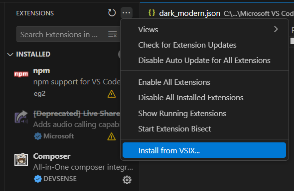

# Darker Modern

A darker variant of VS Code's default dark modern theme, featuring deeper blacks and better contrast.

## Features

- Darker background colors (main editor background is #0c0c0c)
- Maintains VS Code's modern design language
- Improved contrast for better readability
- Consistent color scheme across all UI elements

## Installation

1. Download the `.vsix` file from the [Releases page](https://github.com/moistp1ckle/darker-modern-theme/releases)
2. Open VS Code
3. Go to Extensions (Ctrl+Shift+X)
4. Click the ... (More Actions) button at the top
5. Select "Install from VSIX..."
6. Choose the downloaded .vsix file

  

## Screenshots

[Screenshots coming soon]

## Feedback

If you have suggestions or issues, please open an issue on the [GitHub repository](https://github.com/moistp1ckle/darker-modern-theme).

## License

MIT License - See LICENSE file for details. 